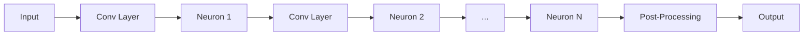

# ODEFuncFromFX: Transforming SNNs into Continuous Dynamical Systems

In **spikeDE**, the `ODEFuncFromFX` module serves as the critical bridge between discrete Spiking Neural Networks (SNNs) and continuous-time numerical solvers. While your neuron defines *what* happens locally (the derivative logic) and the solver handles *how* time evolves (the integration method), `ODEFuncFromFX` is responsible for **rewiring your network architecture** to make it compatible with ODE/FDE solvers.

Traditional SNN frameworks operate on fixed discrete time steps ($t, t+1, t+2$). In contrast, numerical ODE solvers (like those in `torchdiffeq`) require a function $f(t, v)$ that can evaluate the system state at *any* arbitrary continuous time point $t$. This guide explains how `ODEFuncFromFX` uses PyTorch FX graph tracing to automatically transform your standard `nn.Module` into this continuous form, handling input interpolation, state separation, and boundary detection without requiring you to rewrite your model code.

## The Core Challenge: Discrete vs. Continuous

In a standard PyTorch SNN, the forward pass looks like a rigid sequence:



At each discrete step $t$, the neuron updates its membrane potential $v_t$ based on the input $x_t$ and previous state $v_{t-1}$.

However, an ODE solver needs a function that satisfies:

$$ \frac{dv}{dt} = f(t, v(t), x(t)) $$

Here, $t$ is a continuous scalar, and $x(t)$ must be reconstructed from discrete samples via interpolation. `ODEFuncFromFX` automates the transformation of your discrete graph into this continuous vector field.

## Architecture Overview

When you wrap your model with `ODEFuncFromFX`, it performs a "surgical split" of your computation graph into two distinct modules:

1.  **The ODE Graph (`ode_gm`)**: Contains all logic required to compute derivatives. It accepts continuous time $t$ and membrane potentials $v$, interpolates inputs, and returns $(\frac{dv_1}{dt}, \dots, \frac{dv_N}{dt})$ along with necessary boundary signals.
2.  **The Post-Neuron Module (`post_neuron_module`)**: Contains all layers appearing after the last spiking neuron (e.g., voting layers, classification heads). This part remains discrete and is only executed once after the ODE integration finishes.

## Step-by-Step Transformation Pipeline

To understand how `ODEFuncFromFX` works internally, let's trace the transformation of a simple 2-layer SNN:

```python
class MySNN(nn.Module):
    def __init__(self):
        super().__init__()
        self.fc1 = nn.Linear(10, 20)
        self.lif1 = LIFNeuron()  # Neuron Layer 0
        self.fc2 = nn.Linear(20, 5)
        self.lif2 = LIFNeuron()  # Neuron Layer 1 (Last Neuron)
        self.classifier = nn.Linear(5, 2)

    def forward(self, x):
        x = self.lif1(self.fc1(x))
        x = self.lif2(self.fc2(x))
        return self.classifier(x)
```

### Symbolic Tracing with Custom Leaves

The process begins by tracing the network using PyTorch FX. However, we cannot simply decompose everything. Neurons have special semantics (returning both derivative and spike), and post-processing layers should remain intact.

We use a custom `SNNLeafTracer` that treats `BaseNeuron`, `VotingLayer`, and `ClassificationHead` as **leaf nodes**. This prevents the tracer from stepping inside these modules, preserving them as single atomic operations in the graph.

### Constructing the ODE Interface

A new graph is created with inputs specifically designed for ODE solvers:

- `t`: The current continuous time point (scalar).
- `v_mems`: A tuple of membrane potentials $(v_1, v_2, \dots)$ for all neuron layers.
- `x`: The original discrete input tensor (shape `[T, Batch, ...]`).
- `x_time`: The timestamps corresponding to the input steps.

**Input Interpolation**: Since the solver may query time $t=1.5$ even if inputs only exist at $t=1$ and $t=2$, `ODEFuncFromFX` automatically inserts an interpolation node.

$$ x(t) = \text{interpolate}(x, x\_time, t, \text{method}=\text{'linear'}) $$

Supported methods include `'linear'`, `'nearest'`, `'cubic'`, and `'akima'`.

### Rewiring Neuron Layers

The transformer iterates through the original graph. When it encounters a `BaseNeuron`:

1. It extracts the specific membrane potential $v_i$ from the `v_mems` tuple.
2. It calls the neuron with $(v_i, \text{input})$.
3. It splits the output:
    - The derivative $\frac{dv_i}{dt}$ is collected into the final output list.
    - The **spike** output is passed forward to subsequent layers (just like in the original network).

This effectively changes the data flow: instead of updating state internally, the neuron now purely computes the *rate of change* given the current state.

### Intelligent Boundary Detection

One of the most sophisticated features of `ODEFuncFromFX` is determining where the ODE part ends and the post-processing begins. It doesn't just cut after the last neuron; it analyzes dependencies.

If your network has branching paths or if post-neuron layers depend on intermediate tensors from earlier in the graph, the system identifies these as **boundary nodes**.

- **Single Boundary**: If the graph is linear, the output of the last neuron is passed directly to the post-module.
- **Multi-Boundary**: If the post-module depends on multiple tensors (e.g., skip connections), the ODE graph returns a tuple of all required boundary values, and the post-module is rewritten to unpack them.

### Finalizing the Modules

The result is two ready-to-use modules:

1. `self.ode_gm`: A `GraphModule` that computes $( \frac{dv}{dt}, \text{boundaries} )$.
2. `self.post_neuron_module`: A `GraphModule` that takes `boundaries` and produces the final class logits.

## Configuration and Usage

Using `ODEFuncFromFX` is typically handled internally by the `SNNWrapper`, but understanding the configuration helps in debugging and advanced customization.

### Basic Initialization

```python
from spikeDE import ODEFuncFromFX, LIFNeuron
import torch.nn as nn

class MyModel(nn.Module):
    def __init__(self):
        super().__init__()
        self.conv = nn.Conv2d(3, 16, 3)
        self.neuron = LIFNeuron(tau=2.0)
        self.fc = nn.Linear(16, 10)
    
    def forward(self, x):
        x = self.neuron(self.conv(x))
        return self.fc(x)

model = MyModel()

# Wrap with ODEFuncFromFX
ode_func = ODEFuncFromFX(
    backbone=model, 
    interpolation_method='linear'  # Options: 'linear', 'cubic', 'akima', 'nearest'
)
```

### Integration with Solvers

Once wrapped, `ode_func` can be passed directly to an ODE solver. The `SNNWrapper` automates this loop:

```python
# Pseudo-code representation of what SNNWrapper does
v_mems_init = [torch.zeros_like(p) for p in model.parameters() if 'mem' in p] # Simplified

# Solve the ODE: integrates dv/dt over time
result = ode_solver(
    func=ode_func, 
    y0=v_mems_init, 
    t_span=(0, T), 
    method='dopri5'
)

# Extract boundary outputs (spikes) from the solver result
# and pass them to the post-neuron module
final_output = ode_func.get_post_neuron_module>(result.boundaries)
```

### Selecting Interpolation Methods

The choice of interpolation affects how the network perceives input between time steps:

| Method | Description | Best Use Case |
| :--- | :--- | :--- |
| `'linear'` | Linear interpolation between samples. | **Default.** Balanced accuracy and speed for most event-based data. |
| `'nearest'` | Holds the value of the nearest sample (Zero-Order Hold). | Digital inputs or when strict causality without smoothing is required. |
| `'cubic'` | Catmull-Rom cubic spline. | Smooth sensory data (e.g., audio, video) where higher-order continuity helps. |
| `'akima'` | Akima spline (robust against oscillations). | Data with sharp transitions where cubic splines might overshoot. |

## Advanced: Custom Neuron Compatibility

A key design goal of `ODEFuncFromFX` is **transparency**. If you define a custom neuron by inheriting from `BaseNeuron`, it works automatically with this pipeline. You do not need to modify your neuron to support continuous time.

As long as your custom neuron follows the standard signature:
```python
def forward(self, v_mem, x):
    # Compute derivative
    dv_dt = ...
    # Compute spike
    spike = ...
    return dv_dt, spike
```
`ODEFuncFromFX` will correctly trace it, extract the `dv_dt` for the solver, and route the `spike` to downstream layers.

## Summary

`ODEFuncFromFX` is the engine that enables **continuous-depth Spiking Neural Networks**. By leveraging PyTorch FX, it:

1.  **Decouples** state evolution (handled by solvers) from state definition (handled by neurons).
2.  **Interpolates** inputs dynamically, allowing evaluation at arbitrary time points.
3.  **Splits** the computation graph intelligently, ensuring efficient separation between continuous dynamics and discrete readout.

This allows you to write standard PyTorch code while unlocking the power of adaptive step-size solvers, fractional-order calculus, and precise temporal modeling provided by **spikeDE**.